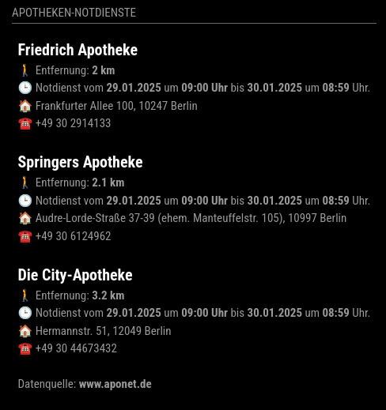

# MMM-ApothekenNotdienst

**MMM-ApothekenNotdienst** is a module for the [MagicMirror²](https://github.com/MagicMirrorOrg/MagicMirror) project.

Since the data is only available in German, the module is also only available in German.

It shows the next pharmacies on duty in Germany. The data is provided by the website [www.aponet.de](https://www.aponet.de/apotheke/notdienstsuche/).

Why should access to information such as emergency pharmacy services be freely available? This ensures that people can quickly find life-saving medicines in emergencies, improves public health, supports innovation in healthcare applications and strengthens transparency and trust in the healthcare system.

## Screenshot



## Installation

Just clone the module into your modules directory of your MagicMirror²:

```bash
cd ~/MagicMirror/modules
git clone https://github.com/KristjanESPERANTO/MMM-ApothekenNotdienst/
```

## Configuration

To use this module, add it to the `config.js` file. Here is a minimal example:

```javascript
{
  module: "MMM-ApothekenNotdienst",
  position: "top_left",
  config: {
    lat: 52.4974,
    lon: 13.4596,
  }
},
```

### Configuration options

| Option           | Description                                                                                             | Type    | Default               |
| ---------------- | ------------------------------------------------------------------------------------------------------- | ------- | --------------------- |
| `lat`            | **Required**<br>Latitude of your location                                                               | Float   | `52.4974`             |
| `lon`            | **Required**<br>Longitude of your location                                                              | Float   | `13.4596`             |
| `day`          | **Optional**<br>Show duties for today or tomorrow. <br> **Possible values:** `"today"` and `"tomorrow"` | String  | `"today"`             |
| `radius`         | **Optional**<br>Radius in km around your location                                                       | Integer | `5`                   |
| `maxEntries`     | **Optional**<br>Maximum number of entries to show                                                       | Integer | `3`                   |
| `updateInterval` | **Optional**<br>Update interval in milliseconds                                                         | Integer | `30 * 60 * 1000` (30 minutes) |

## Update

Go to the module’s directory and pull the latest version from GitHub:

```bash
cd ~/MagicMirror/modules/MMM-ApothekenNotdienst
git pull
```

## Special Thanks

- The great community of [MagicMirror²](https://github.com/MagicMirrorOrg/MagicMirror) that keeps this impressive project alive and permanently improves it.
- aponet.de for providing the data.

## Contributing

If you find any problems, bugs or have questions, please [open a GitHub issue](https://github.com/KristjanESPERANTO/MMM-ApothekenNotdienst/issues) in this repository.

Pull requests are of course also very welcome 🙂

### Code of Conduct

Please note that this project is released with a [Contributor Code of Conduct](CODE_OF_CONDUCT.md). By participating in this project you agree to abide by its terms.

### Developer commands

- `npm run lint` - Run linting and formatter checks.
- `npm run lint:fix` - Fix linting and formatter issues.
- `npm run test` - Run linting and formatter checks + run spelling check.

## License

This project is licensed under the ISC License - see the [LICENSE](LICENSE.md) file for details.

## Changelog

All notable changes to this project will be documented in the [CHANGELOG.md](./CHANGELOG.md) file.
