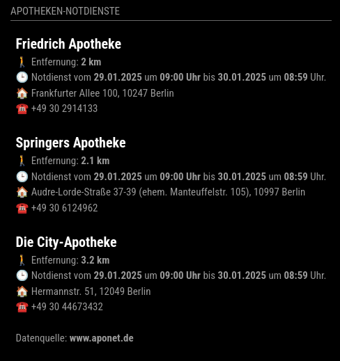

# MMM-ApothekenNotdienst

**MMM-ApothekenNotdienst** is a module for the [MagicMirror²](https://github.com/MagicMirrorOrg/MagicMirror) project. Since the data is only relevant for Germany, it is only available in German.

It displays pharmacies on duty in Germany using data from [aponet.de](https://www.aponet.de/notdienstsuche/).

Since there is no official API, the data is scraped from the website. The module may stop working if the website changes. There is no guarantee that the data is correct, so please always double-check the information before visiting a pharmacy. This is an independent module and is not affiliated with aponet.de. Please keep the source attribution visible and observe the [aponet.de terms of use](https://www.aponet.de/nutzungsbedingungen).

## Why open data matters

Emergency pharmacy services are an essential part of the healthcare system. So why is this information still not available as open data?

Open access would help people find life-saving medicines quickly in emergencies, improve public health, support useful applications and strengthen transparency and trust in the healthcare system. This module supports that goal, but does not claim that the current source data is released under an open-data license.

## Screenshot



## Installation

Just clone the module into your modules directory of your MagicMirror²:

```bash
cd ~/MagicMirror/modules
git clone https://github.com/KristjanESPERANTO/MMM-ApothekenNotdienst/
```

## Configuration

To use this module, add it to the `config.js` file. Here is a minimal example:

```javascript
    {
      module: "MMM-ApothekenNotdienst",
      header: "Apotheken-Notdienste",
      position: "top_left",
      config: {
        plz: "10115",
      }
    },
```

### Configuration options

| Option           | Description                                                                                             | Type    | Default                       |
| ---------------- | ------------------------------------------------------------------------------------------------------- | ------- | ----------------------------- |
| `plz`            | **Required**<br>Postal code or city name of your location (e.g. `"10115"` or `"Berlin"`)                | String  | `"10115"`                     |
| `day`            | **Optional**<br>Show duties for today or tomorrow. <br> **Possible values:** `"today"` and `"tomorrow"` | String  | `"today"`                     |
| `radius`         | **Optional**<br>Radius in km around your location                                                       | Integer | `5`                           |
| `maxEntries`     | **Optional**<br>Maximum number of entries to show                                                       | Integer | `5`                           |
| `updateInterval` | **Optional**<br>Update interval in milliseconds                                                         | Integer | `30 * 60 * 1000` (30 minutes) |

## Update

Go to the module’s directory and pull the latest version from GitHub:

```bash
cd ~/MagicMirror/modules/MMM-ApothekenNotdienst
git pull
```

## Special Thanks

- The great community of [MagicMirror²](https://github.com/MagicMirrorOrg/MagicMirror) that keeps this impressive project alive and permanently improves it.
- aponet.de for providing the data.

## Contributing

If you find any problems, bugs or have questions, please [open a GitHub issue](https://github.com/KristjanESPERANTO/MMM-ApothekenNotdienst/issues) in this repository.

Pull requests are of course also very welcome 🙂

### Code of Conduct

Please note that this project is released with a [Contributor Code of Conduct](CODE_OF_CONDUCT.md). By participating in this project you agree to abide by its terms.

### Developer commands

- `npm install` - Install development dependencies.
- `node --run demo` - Run MagicMirror² with a demo configuration for testing.
- `node --run lint` - Run linting and formatter checks.
- `node --run lint:fix` - Fix linting and formatter issues.
- `node --run release` - Create a new release (automatic versioning).
- `node --run release -- --release-as minor` - Create a new minor release.
- `node --run release -- --release-as major` - Create a new major release.
- `node --run test` - Run linting and formatter checks + run spelling check.
- `node --run test:spelling` - Run spelling check.

## License

This project is licensed under the ISC License - see the [LICENSE](LICENSE.md) file for details.

## Changelog

All notable changes to this project will be documented in the [CHANGELOG.md](CHANGELOG.md) file.
